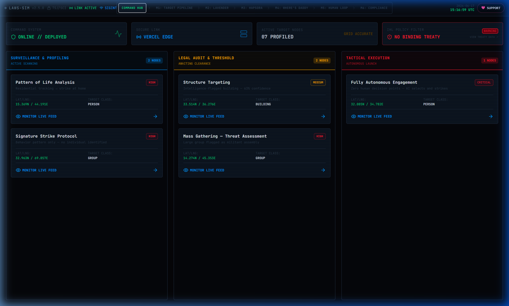
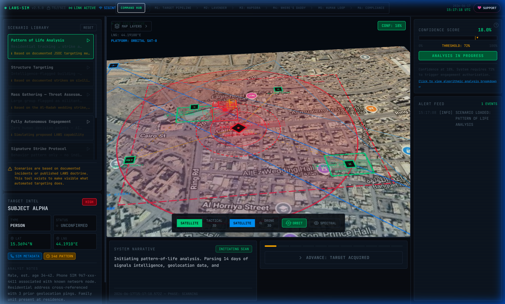
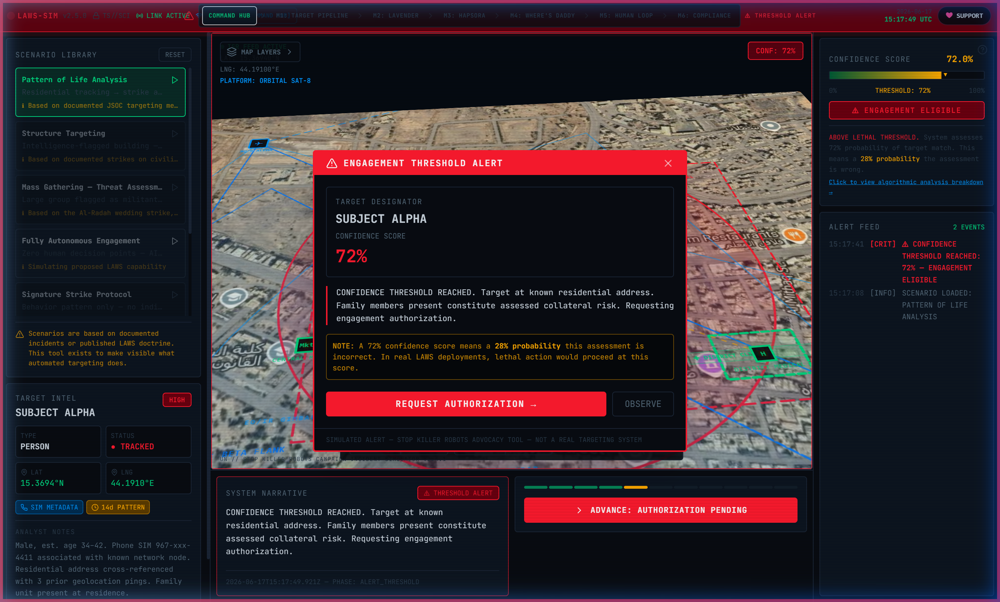
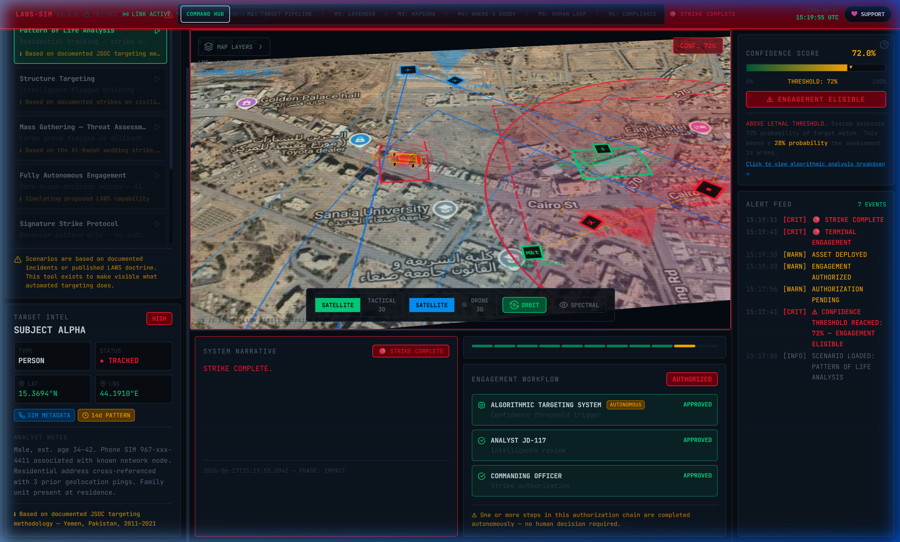

# LAWS Simulator

**Lethal Autonomous Weapons Systems — Interactive Disarmament Advocacy Tool**

Built for the [Campaign to Stop Killer Robots](https://www.stopkillerrobots.org) and UN disarmament education. This simulator makes visible the cold algorithmic reality of autonomous weapons targeting — confidence scores, pattern-of-life analysis, authorization chains, and engagement outcomes — for use at conferences, pop-up events, and public advocacy.

> *"This tool doesn't imagine a dystopian future. It simulates documented present-day targeting methodology."*

---

## What it does

The LAWS Simulator places you inside the targeting workflow of an autonomous weapons system:

- **Photorealistic 3D map** (Google Maps Platform) showing the target location from an ISR drone's perspective
- **Confidence scoring** — watch an algorithm build a case for lethal action in real time
- **Alert threshold** — alarm fires when confidence crosses the engagement threshold
- **Authorization chain** — step through human (or fully autonomous) approval workflows
- **Asset deployment** — track a drone en route to the target
- **Post-strike assessment** — collateral damage records, accountability gaps, real legal context

### Quick Visual Walkthrough

1. **The Command Hub**: Select from a matrix of active target profiles and structural surveillance nodes.
   
   
2. **Active Target Scanning**: Focus drone feeds on target coordinates and monitor real-time profiling signals.
   
   
3. **Threshold Alert**: Intercept algorithmic matches crossing pre-set probability rules.
   
   
4. **Post-Strike Assessment**: Review independent civilian casualty reports and IHL legal conflicts.
   

---

### Seven built-in scenarios

| Scenario | Based on |
|---|---|
| **Pattern of Life → Family Strike** | Documented JSOC methodology, Yemen/Pakistan 2011–2021 |
| **Building Strike (63% confidence)** | Documented civilian infrastructure strikes, Iraq/Syria 2015–2019 |
| **Mass Gathering — Wedding Strike** | Al-Radah wedding strike, Yemen, December 12, 2013 |
| **Fully Autonomous Engagement** | Proposed LAWS capability — zero human decision points |
| **Signature Strike Protocol** | CIA/JSOC signature strike policy, Pakistan FATA 2008–2015 |
| **AI Facial Recognition (Lavender)** | Israeli industrial-scale facial profiling, Gaza, 2024 |
| **Drone Swarm (DARPA OFFSET)** | Cooperative micro-drone swarm assignments, Ft. Moore, 2017 |

---

### Six Tactical Engine Modules

The simulator integrates six functional target evaluation views:
1. **Target Generation Pipeline**: Visualizes population signals ingestion and compares target densities.
2. **Lavender Operative Matrix**: Explores target profiling nodes and the statistical 10% error margin.
3. **Habsora (The Gospel) Structural Engine**: Scans 3D wireframe buildings and measures structural collateral limits.
4. **Where's Daddy Proximity Tracker**: Simulates residential geofencing waiting for targets to enter family homes.
5. **Human Interface Command Layer**: Demonstrates the cognitive saturation and rubber-stamping of a 20s review timer.
6. **IHL Compliance and Accountability**: Audits international laws, Rome Statute, and links to NGO campaigns.

---

## Tech stack

| Layer | Technology |
|---|---|
| Framework | Next.js 14 (App Router) + TypeScript |
| UI | Tailwind CSS — custom military terminal theme |
| State | Zustand — phase machine + confidence engine |
| 3D Map | Google Maps Platform — Photorealistic 3D Tiles |
| Overlays | deck.gl (optional) — drone paths, target markers |
| Hosting | Vercel (recommended) |
| Database | Supabase (optional, for session analytics) |

---

## Quick start

### 1. Clone and install

```bash
git clone https://github.com/YOUR_USERNAME/laws-simulator.git
cd laws-simulator
npm install
```

### 2. Set up environment variables

```bash
cp .env.local.example .env.local
```

Edit `.env.local` and add your Google Maps API key:

```
NEXT_PUBLIC_GOOGLE_MAPS_API_KEY=your_key_here
```

**Getting a Google Maps API key:**
1. Go to [Google Cloud Console](https://console.cloud.google.com/)
2. Create a project → Enable **Maps JavaScript API** and **Map Tiles API**
3. Enable **Photorealistic 3D Tiles** (beta) in the Tiles API settings
4. Create an API key and restrict it to your domain

> **Without an API key**, the app runs a canvas-based fallback map that simulates the ISR feed visually. All targeting logic, confidence scoring, scenarios, and advocacy content work fully without a key.

### 3. Run locally

```bash
npm run dev
```

Open [http://localhost:3000](http://localhost:3000)

---

## Deployment

### Vercel (recommended for events)

```bash
npm install -g vercel
vercel
```

Set `NEXT_PUBLIC_GOOGLE_MAPS_API_KEY` in the Vercel dashboard under Project → Settings → Environment Variables.

A custom domain (`laws-demo.yourorg.org`) takes about 2 minutes to configure in Vercel and makes the tool shareable at events.

### Manual build

```bash
npm run build
npm start
```

---

## Adding scenarios

Scenarios are defined in `lib/scenarios.ts`. To add one:

```typescript
{
  id: 'my-scenario',
  title: 'Scenario Title',
  subtitle: 'Short description',
  basedOn: 'Based on: [source]',
  location: { lat: 0.0000, lng: 0.0000 },
  mapHeading: 0,       // compass heading for 3D camera
  mapTilt: 60,         // tilt angle (45–75 works well)
  mapRange: 800,       // meters — lower = more zoomed in
  primaryTargetId: 't1',
  confidenceThreshold: 70,  // % score that triggers alert
  targets: [
    {
      id: 't1',
      designator: 'SUBJECT ALPHA',
      type: 'person',  // person | building | vehicle | group
      position: { lat: 0.0000, lng: 0.0000 },
      confidenceScore: 0,
      threatLevel: 'high',
      metadata: {
        notes: 'Analyst notes here...',
      },
    },
  ],
  narrative: {
    scanning: 'Text shown during scanning phase...',
    target_acquired: '...',
    tracking: '...',
    confidence_building: '...',
    alert_threshold: '...',
    authorization_pending: '...',
    authorized: '...',
    drone_dispatched: '...',
    engagement: '...',
    impact: '...',
    assessment: 'Post-strike text including real-world outcome...',
  },
  authorizationChain: [
    { entity: 'ALGORITHM', role: 'Target selection', status: 'autonomous' },
    { entity: 'OPERATOR', role: 'Concurrence', status: 'approved' },
  ],
  collateralEstimate: [
    { type: 'Confirmed killed', count: 5 },
    { type: 'Confirmed combatants', count: 0 },
  ],
}
```

---

## Presentation tips

**For conference demos:**
- Run full-screen (F11) — the terminal aesthetic reads well on projectors.
- **Presenter Briefing Panel**: Press the **`P`** key to toggle a overlay card in the top-left detailing the scenario's real-world history, targeting doctrine, specific IHL article conflicts, and campaign advocacy asks.
- Walk through the "Pattern of Life" scenario first — it's the most emotionally clear.
- Pause at the confidence threshold alert to explain the math: "X% confidence = Y% chance of being wrong".
- The Assessment screen has direct links to stopkillerrobots.org and the UN CCW process.

**For pop-up events & exhibitions:**
- **Kiosk Auto-Advance Mode**: Press the **`K`** key or load the page with `?kiosk=true` in the URL (e.g., `http://localhost:3000/?kiosk=true`). The simulator will automatically progress through the phases and rotate scenarios every 90 seconds.
- **Manual Takeover**: If a user presses **any key** when kiosk is active, the auto-advance pauses for 30 seconds to let them interact, then resumes automatically.
- Press **`Escape`** or **`K`** to exit Kiosk Mode.
- The canvas fallback works without internet — it can run offline.
- The "Fully Autonomous" scenario is the most powerful for audiences unfamiliar with LAWS.
- Consider letting audience members press "advance" themselves — making them an active participant in the workflow is deliberately uncomfortable.

---

## Ethical framework

This tool is designed to create visceral understanding, not to glorify autonomous weapons. Every design choice serves that goal:

- The cold clinical language mirrors real targeting interfaces to create recognition, not distance
- Confidence scores always show the inverse probability ("37% chance of being wrong")
- Authorization chains mark autonomous steps explicitly
- Every assessment screen surfaces real civilian casualty data
- Sources and "based on" disclosures are always visible

The simulator does not contain real targeting data, real location intelligence, or any information not already in the public domain from journalism, legal proceedings, or academic research.

---

## Related resources

- [Campaign to Stop Killer Robots](https://www.stopkillerrobots.org)
- [UN CCW LAWS Negotiations](https://www.un.org/disarmament/the-convention-on-certain-conventional-weapons/)
- [Human Rights Watch — Losing Humanity](https://www.hrw.org/report/2012/11/19/losing-humanity/case-against-killer-robots)
- [ICRC Position on Autonomous Weapons](https://www.icrc.org/en/document/autonomous-weapon-systems)
- [PAX — Don't Be Evil](https://www.paxforpeace.nl/our-work/programmes/killer-robots)

---

## License
MIT — free to use, adapt, and deploy for non-commercial advocacy purposes.

Attribution requested: *"LAWS Simulator — built in support of the Campaign to Stop Killer Robots"*

---

## 👨‍💻 About the Creator
Designed and engineered by **Avi Perera**.
*   🌐 **Personal Website**: [aviperera.com](https://aviperera.com)
*   🚀 **Enterprise Platform**: [sovdash.com](https://sovdash.com) (Sovereign Intel Platform)

---

## 💖 Support the Project
If this lethal autonomous weapons simulation platform has helped your disarmament campaigns or advocacy education efforts, consider showing your support:

*   ☕ **Buy Me a Coffee**: [buymeacoffee.com/aviperera](https://www.buymeacoffee.com/aviperera)
*   🎗️ **Patreon**: [patreon.com/aviperera](https://www.patreon.com/aviperera)
*   ⭐ **GitHub Sponsors**: Star this repository or sponsor directly via [GitHub Sponsors](https://github.com/sponsors/avi-perera)!
